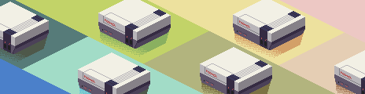

# pix2svg

> Warning: This project is mainly created by GitHub Copilot with Claude Sonnet 4. Not fully reviewd and tested yet. Use it at your own risk. PRs and issues are welcome.

A fast and efficient command-line tool to convert pixel art images to optimized SVG format with greedy rectangle merging.

## Installation

### From Source

```bash
git clone https://github.com/LeSnow-Ye/pix2svg.git
cd pix2svg
cargo build --release
```

The binary will be available at `target/release/pix2svg`.

### Using Cargo

```bash
cargo install pix2svg
```

## Usage

### Basic Usage

```bash
# Convert image.png to image.svg
pix2svg image.png

# Specify output file
pix2svg image.png -o output.svg

# Scale pixels by 4x
pix2svg image.png -s 4

# Enable verbose output
pix2svg image.png -v
```

### Advanced Options

```bash
# Convert with custom alpha threshold
pix2svg image.png --alpha-threshold 128

# Scale up and specify output
pix2svg sprite.png -s 8 -o large-sprite.svg -v
```

### Command Line Options

- `input`: Input image file path
- `-o, --output`: Output SVG file path (default: input filename with .svg extension)
- `-s, --scale`: Pixel scale factor (1-1000, default: 1)
- `--alpha-threshold`: Minimum alpha threshold for non-transparent pixels (0-255, default: 1)
- `--skip-transparent`: Skip transparent pixels (default: true)
- `-f, --force`: Force overwrite existing output files
- `-v, --verbose`: Enable verbose output
- `-h, --help`: Show help information

## Algorithm

The tool uses a greedy rectangle merging algorithm similar to the one used in Aseprite:

1. **Scan pixels**: Process image pixel by pixel from top-left to bottom-right
2. **Find rectangles**: For each unprocessed pixel, find the largest rectangle of the same color
3. **Optimize**: Greedily expand rectangles horizontally and vertically
4. **Output**: Generate SVG `<rect>` elements for each rectangle

This approach significantly reduces the number of SVG elements compared to naive pixel-by-pixel conversion.

## Examples

### Input

> Source: [CC-29 Palette](https://lospec.com/palette-list/cc-29)

464x120 = 55680 pixels



### Output

4738 rectangles (8.51%)


## License

This project is licensed under the MIT License - see the LICENSE file for details.
